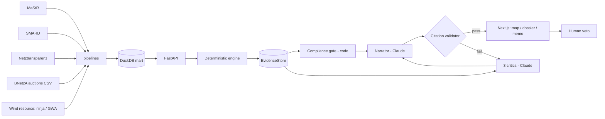

# RHEINGOLD

**Underwriting the Energiewende.** Pick any real wind farm in Germany → get a
full, cited investment-committee memo — valuation, debt capacity, stress tests —
in about two minutes.

<!-- HERO GIF: the 20s clip (§1) goes here -->

## Why this exists

Every input is live public German data: the MaStR registry, SMARD prices, BNetzA
auctions, Netztransparenz market values. The finance core is deterministic and
auditable; the agent layer only narrates evidence it can cite. And the
availability and O&M assumptions come from someone who spent two years building
manufacturing data systems across 10+ wind plants at Suzlon — watching real
turbines fail and recover.

## Architecture



The deterministic engine (`packages/engine`) is pure Python — no network, no
LLM, no unseeded randomness. Agents read a frozen EvidenceStore and argue about
it; a citation-integrity validator they cannot talk their way past rejects any
memo whose numbers don't trace to evidence.

## Screenshots

<!-- map · dossier · memo · backtest -->

## Data sources & licenses

See [docs/DATA_SOURCES.md](docs/DATA_SOURCES.md). Highlights: MaStR
(DL-DE/BY-2.0), SMARD (CC BY 4.0), Netztransparenz (attribution),
renewables.ninja (**CC BY-NC 4.0 — this project is non-commercial**).

## Results

From `make backtest` (§12, deterministic, seed 42): **the median model bid
tracks the observed BNetzA award-price trajectory 2017–2024 with MAE ≈ 1.10
ct/kWh** across the 22 priceable rounds (directional hit-rate 0.55). Two
honest failure modes are part of the result: 2019–2020 rounds run ~1.3–1.6 ct
below actual awards (undersubscribed rounds pushed clearing prices to the
Höchstwert — a winner's-curse-free regime the break-even model cannot see),
and the 2021–2023 rounds are **unpriceable** under a flat forward at
crisis-year spot levels (any bid ≥ 0.5 ct cleared the hurdle) — recorded as
skipped-with-reason in the output rather than hidden.

## Limitations

The honest section. See [docs/MODEL_CARD.md](docs/MODEL_CARD.md): annual (not
monthly) debt model, two-pass tax (no Zinsschranke, no loss carryforward),
single-int §51 modeling, merchant tail without a forward curve, Path B resource
error, and every backtest caveat (winner's curse, undersubscribed rounds,
binding price caps, site-selection bias).

## Run locally

```bash
cp .env.example .env       # add ANTHROPIC_API_KEY for memos (optional)
make data                  # MaStR + SMARD + Marktwerte + fleet build (~30 min first run)
make dev                   # web :3000 + api :8000
make engine-test           # the golden farm must always pass
```

## Author

Siddharth Jain — manufacturing → capital.
*Das neue Rheingold ist Wind.*
