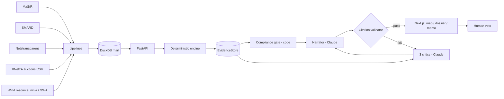

# RHEINGOLD — Build Specification v1.0

**German Renewable-Energy Project-Finance Intelligence Platform**
**Author:** Siddharth Jain · **Date:** July 2026 · **Status:** Authoritative build spec for Claude Code
**Repo name:** `rheingold` · **Tagline:** *Underwriting the Energiewende.* · **Substack hook:** *"Das neue Rheingold ist Wind."*

---

## §0 — How Claude Code must use this document

This file is the single source of truth. Read it fully before writing any code. Then work phase by phase (§14), never skipping a phase gate. Rules of engagement:

1. **Plan first.** At the start of each phase, produce a short plan (files to create, order, tests) before writing code.
2. **Deterministic core is sacred.** Everything in `packages/engine` is pure Python: no network calls, no randomness without an explicit seed, no LLM calls. Same inputs → identical outputs, always.
3. **TDD on the engine.** Write the golden-farm test fixture (§13.2) before the engine modules. Engine code without passing tests does not advance a phase.
4. **Never fabricate data.** All market/registry data comes from the sources in §7. If a source fails, raise a clear error and stop — do not invent placeholder numbers. Synthetic data appears in exactly one place: the golden-farm test fixture, which is clearly labeled as a test artifact.
5. **`VERIFY:` tags.** Wherever this doc says `VERIFY:`, the value or endpoint may have drifted since writing. Confirm it against the linked source at build time before hardcoding. Do not silently trust it; do not silently change it either — log what you found.
6. **Commit style:** conventional commits (`feat(engine): debt sculpting`, `test(engine): golden farm DSCR`). Small, frequent commits.
7. **No scope additions.** The out-of-scope list (§0.2) is binding. If something seems missing, it is missing on purpose.
8. **UI fidelity.** §3 (design system) and §4 (reference repos) are not suggestions. Every color, font, and component pattern derives from §3. When unsure how something should look, consult the mapped reference repo in §4 before improvising.

### §0.1 Definition of Done (MVP)

- [ ] Map of Germany renders the full onshore wind fleet (~28–30k units) from real MaStR data at 60fps.
- [ ] Clicking any wind farm opens a dossier with P50/P90 energy, revenue stack, sculpted debt schedule, DSCR/LLCR, LCOE, equity IRR, tornado sensitivities.
- [ ] Scenario sliders re-price the deal in <2s client-perceived latency.
- [ ] "Generate IC Memo" streams a cited, structured investment-committee memo; every number in it passes the citation-integrity validator (§9.6).
- [ ] Auction backtest page shows model bid band vs. actual BNetzA onshore clearing prices 2017–2025 with MAE stated.
- [ ] 5 showcase farms fully precomputed; demo works with the API asleep.
- [ ] Deployed: web on Vercel, API on Render/Fly. README with architecture diagram, GIF, license table. All engine tests green in CI.

### §0.2 Out of scope (do NOT build)

Solar/offshore (v1 footnote only) · user accounts/auth · Postgres or any DB server (DuckDB + Parquet only) · live PPA quotes · i18n framework (German terms appear as domain flavor, UI is English) · LangChain/LangGraph (plain Anthropic SDK + own orchestration; simpler for this scope) · mobile app · Mapbox (token-gated; use MapLibre) · react-hook-form/Redux (useState/Zustand is enough) · tax structuring beyond the simple module in §8.7.

---

## §1 — Mission & demo storyboard

**One-liner:** Pick any real wind farm in Germany → get a full, cited investment-committee memo (valuation, debt capacity, stress tests) in about two minutes.

**Why it wins:** every input is live public German data (MaStR registry, SMARD prices, BNetzA auctions, Netztransparenz market values); the finance core is deterministic and auditable; the agent layer only narrates evidence it can cite; and the author spent two years building manufacturing data systems across 10+ wind plants at Suzlon — the availability and O&M assumptions come from someone who has watched real turbines fail and recover.

**The 20-second clip (build everything so this lands):**

| t | Shot |
|---|---|
| 0–3s | Dark map of Germany. ~30,000 gold points shimmer in — every registered onshore turbine. |
| 3–6s | Zoom to a named farm cluster in Brandenburg. Points resolve into a farm boundary + label. |
| 6–10s | Click → dossier panel slides in. KPIs count up: P50 GWh, DSCR 1.32×, Equity IRR 8.4%. |
| 10–15s | Drag the power-price slider −20%. Waterfall, DSCR chart, verdict chip update live. |
| 15–20s | "Generate IC Memo" → memo streams onto a paper panel, gold citation seals attach, verdict stamp lands: **PROCEED WITH CONDITIONS**. End card: *RHEINGOLD — Wind. Underwritten.* |

---

## §2 — Product spec

### §2.1 Personas

1. **Project-finance analyst** (KfW IPEX, Helaba, Commerzbank energy desk): wants DSCR/LLCR, debt capacity, covenant headroom, downside cases.
2. **Infrastructure-fund associate** (DWS, Union Investment, Deka): wants equity IRR, sensitivity to merchant tail, capture rates.
3. **The hiring manager** (the real user): wants to see, in 3 minutes, that the author can combine real data + quant rigor + agentic AI + production polish.

### §2.2 Core user stories

- As an analyst, I pan a map of Germany's entire onshore fleet and filter by capacity, commissioning year, manufacturer, Bundesland.
- As an analyst, I open a farm and see its registry facts (turbine model, hub height, MW, operator, commissioning date) with source links.
- As an analyst, I see a P50/P90 energy estimate with the uncertainty stack made explicit.
- As an analyst, I see the revenue stack (EEG market premium vs. merchant vs. PPA toggle) priced off real SMARD/Netztransparenz data.
- As an analyst, I get a sculpted debt schedule to a target DSCR, with gearing cap, DSRA, LLCR/PLCR.
- As an analyst, I drag scenario sliders (price, production, rates, capex, availability, curtailment) and watch every metric re-price.
- As an IC member, I generate a memo where every number carries a citation seal I can hover to inspect, and I can veto/annotate before export.
- As a skeptic, I open `/backtest` and see the model's required-bid band tracking actual BNetzA auction clearing prices 2017–2025.
- As a reviewer, I open `/methodology` and find every assumption, formula, source, and license.

### §2.3 Pages (routes)

| Route | Job |
|---|---|
| `/` | Full-bleed map explorer. The hero *is* the fleet. |
| `/farm/[id]` | Dossier: tabs **Overview · Energy · Revenue · Debt · Scenarios · IC Memo** |
| `/backtest` | Auction validation study (the falsifiable-claim page) |
| `/methodology` | Assumptions, formulas, data lineage, licenses |
| `/about` | Project story, author, the Suzlon→Senvion footnote (§17.3) |

---

## §3 — Design system ("Nachtgold")

**Design thesis.** A Bloomberg-terminal night shift wrapping a paper credit memo. The app chrome is dark obsidian — control-room, trading-desk heritage. Gold is *never decoration*: it is reserved exclusively for **data** — turbine points, key figures, citation seals. The Rhine appears as a cold blue-teal used only for debt/liability/water semantics. The **signature element** — the one aesthetic risk — is the IC memo rendered as a warm paper document *inside* the dark terminal (like a physical credit memo lying on a desk), with gold wax-seal citation chips and an ink verdict stamp. Everything else stays quiet and disciplined.

This is grounded in the brief, not a default: the gold is literally the Rheingold; the paper memo is the "Initiating Coverage" research-desk aesthetic of the author's portfolio.

### §3.1 Color tokens (CSS variables, exact)

```css
:root {
  /* Surfaces */
  --bg-0: #0B0B0E;      /* app background — obsidian */
  --bg-1: #121217;      /* panels */
  --bg-2: #1A1B21;      /* raised cards, table headers */
  --border: #26262E;    /* 1px hairlines everywhere; no shadows */

  /* The gold — DATA ONLY (turbines, key numbers, citations, primary CTA) */
  --gold-500: #C9A227;
  --gold-400: #E3B93C;  /* hover */
  --gold-300: #F0D06A;  /* selected turbine pulse */
  --gold-dim: rgba(201,162,39,0.16);  /* fills, focus rings */

  /* The Rhine — debt, liabilities, water, secondary series */
  --rhine-500: #3E7C9B;
  --rhine-300: #6FA7C4;

  /* Text */
  --text-hi: #F2EFE6;   /* warm off-white */
  --text-mid: #B9B4A6;
  --text-low: #6E6A5E;

  /* Semantics */
  --pos: #3FA47A;  --neg: #C4554D;  --warn: #D08A2E;

  /* The paper memo (signature element) */
  --paper: #F4EFE2;  --paper-edge: #E4DCC8;  --ink: #1E1B14;
  --stamp-proceed: #2E6E4E;  --stamp-conditions: #8A6D1C;  --stamp-decline: #8A3B33;
}
```

Rules: gold never appears on chrome (nav, borders, generic buttons — one primary CTA per view max). Charts: primary series gold, comparison series rhine, never more than 4 series. Backgrounds never pure black; text never pure white.

### §3.2 Typography

| Role | Face | Usage |
|---|---|---|
| Display / memo | **Newsreader** (Google Fonts, optical sizes) | Memo body & headings on paper panel, page heroes, verdict stamp uses 700 |
| UI | **IBM Plex Sans** | All chrome, labels, buttons |
| Data | **IBM Plex Mono** | Every number in the app. `font-feature-settings: "tnum"` for tabular figures |

Scale (px): 12 / 13 (data tables) / 14 (UI base) / 16 / 20 / 28 / 40. Data tables run dense at 13px mono, 32px row height, right-aligned numerals — terminal density, not marketing airiness. The memo panel switches to Newsreader 17/1.6 on `--paper` with `--ink` text: the register shift *is* the design moment.

### §3.3 Motion & interaction

150–200ms ease-out everywhere; map `flyTo` 800ms; KPI count-up 600ms on first paint only; selected turbine = 2s gold pulse ring; memo streams with a subtle typewriter reveal; verdict stamp drops with a single 250ms scale+rotate(-3deg) settle. Respect `prefers-reduced-motion`. Focus rings: 2px `--gold-dim`. No parallax, no gradients except a barely-visible radial gold glow behind the map hero.

### §3.4 Component inventory (build in `apps/web/components/`)

`AppShell` (left rail nav, 56px) · `MapCanvas` (deck.gl + MapLibre) · `FleetFilterBar` · `FarmPopover` · `KPICard` (label / mono value / delta) · `MetricStat` · `CashflowWaterfall` · `DSCRChart` (bars + covenant line 1.20×) · `DebtScheduleTable` · `TornadoChart` · `PriceChart` (lightweight-charts, SMARD series) · `EnergyDistribution` (P50/P75/P90 markers) · `ScenarioSliders` (6 sliders + preset chips) · `VerdictChip` · `MemoPaper` (the signature component) · `CitationSeal` (gold chip → hover card with evidence JSON) · `AgentDebatePanel` (claims by agent, severity-tinted) · `VetoBar` (approve / annotate / veto per section) · `AuctionBacktestChart` · `MethodologyAccordion` · `SourceBadge` (license-aware) · `EmptyState` · `ErrorState`.

---

## §4 — Top 10 GitHub UI reference repos (study before building; steal patterns, not code wholesale)

Ranked by relevance. For each: what it is, and precisely what to take.

| # | Repo | Take this |
|---|---|---|
| 1 | `github.com/OpenBB-finance/OpenBB` | The open-source Bloomberg. **Steal:** terminal information density, mono-numeral tables, dark financial product *feel*, how a serious finance tool signals seriousness. This is the product-register benchmark. |
| 2 | `github.com/visgl/deck.gl` | WebGL data layers on maps. **Steal:** `ScatterplotLayer` for 30k turbine points (it eats this for breakfast), radius-by-MW scaling, picking/hover callbacks, `FlyToInterpolator`. Study the ScatterplotLayer + react-map-gl examples in `examples/`. |
| 3 | `github.com/visgl/react-map-gl` | React bindings for MapLibre. **Steal:** the exact `<Map>` + deck.gl overlay integration pattern, controlled viewState, popup anchoring for `FarmPopover`. |
| 4 | `github.com/keplergl/kepler.gl` | Uber's geospatial exploration tool. **Steal:** UX patterns only — layer filter panel, dark-map + side-panel layout, tooltip design for dense point data. Do not import it; it's the interaction reference. |
| 5 | `github.com/shadcn-ui/ui` | Component foundation. **Steal:** Tabs, Dialog, HoverCard (→ `CitationSeal`), Slider (→ `ScenarioSliders`), Accordion (→ `/methodology`). Restyle every token to §3.1 — zero default shadcn zinc/slate may survive. |
| 6 | `github.com/tremorlabs/tremor` | Dashboard blocks for React. **Steal:** KPI card composition, delta badges, chart-in-card spacing rhythm. Port the *layout logic* into §3 tokens rather than importing tremor's theme. |
| 7 | `github.com/tradingview/lightweight-charts` | TradingView's chart engine. **Steal:** use it directly for `PriceChart` (SMARD day-ahead series + monthly Marktwert overlay). Nothing else renders financial time series with this much desk credibility per KB. |
| 8 | `github.com/airbnb/visx` | Low-level D3+React primitives. **Steal:** build `TornadoChart`, `CashflowWaterfall`, `DSCRChart`, `EnergyDistribution` with visx `Bar`/`Threshold`/`Annotation` — custom, on-token, no charting-library default look. |
| 9 | `github.com/assistant-ui/assistant-ui` | AI chat/streaming UI primitives. **Steal:** streaming message rendering, tool-call status affordances, auto-scroll behavior for `MemoPaper` streaming and `AgentDebatePanel`. |
| 10 | `github.com/satnaing/shadcn-admin` | Polished shadcn admin template. **Steal:** app-shell architecture — sidebar/rail, header, responsive panel layout, table page composition for `DebtScheduleTable`. |

**Honorable mentions:** `maplibre/maplibre-gl-js` (the map engine itself — dark style JSON), `apache/echarts` (fallback if a visx chart fights back), `CopilotKit/CopilotKit` (agentic UI patterns), `plouc/nivo` (chart composition ideas), `carbon-design-system/carbon` (IBM Plex usage in anger — data-table density done right).

**Basemap:** MapLibre GL with CARTO "Dark Matter" style (`https://basemaps.cartocdn.com/gl/dark-matter-gl-style/style.json`) + required attribution. `VERIFY:` CARTO basemap terms still allow non-commercial demo use; fallback = Protomaps free tier or OpenFreeMap.


---

## §5 — Architecture & repository layout

```
rheingold/
├── CLAUDE.md                     # Appendix A of this doc, verbatim
├── README.md
├── docs/
│   ├── RHEINGOLD_BUILD_SPEC.md   # this file
│   ├── DATA_SOURCES.md           # §7 licenses table + lineage
│   ├── MODEL_CARD.md             # engine assumptions, agent limits
│   └── architecture.mmd          # mermaid, §17.2
├── apps/
│   ├── web/                      # Next.js 14 (App Router, TS)
│   │   ├── app/                  # routes per §2.3
│   │   ├── components/           # §3.4 inventory
│   │   ├── lib/                  # api client, formatters (de-DE numbers)
│   │   └── public/showcase/      # precomputed farm JSONs (§15)
│   └── api/                      # FastAPI
│       ├── main.py               # routes per §10
│       ├── deps.py               # engine + duckdb wiring
│       └── memo_stream.py        # SSE agent streaming
├── packages/
│   ├── engine/                   # PURE deterministic finance core
│   │   ├── rheingold_engine/
│   │   │   ├── energy.py         # §8.2
│   │   │   ├── revenue.py        # §8.3
│   │   │   ├── costs.py          # §8.4
│   │   │   ├── debt.py           # §8.5 sculpting, DSCR/LLCR/PLCR
│   │   │   ├── valuation.py      # §8.6 DCF, IRR, LCOE, break-even bid
│   │   │   ├── tax.py            # §8.7
│   │   │   ├── scenarios.py      # §8.8 presets + shocks
│   │   │   ├── sensitivity.py    # tornado
│   │   │   ├── evidence.py       # §9.5 evidence store builder
│   │   │   └── models.py         # pydantic I/O contracts
│   │   └── tests/                # §13
│   └── agents/
│       ├── rheingold_agents/
│       │   ├── orchestrator.py   # §9.3 protocol
│       │   ├── critics.py        # resource / revenue / credit
│       │   ├── narrator.py
│       │   ├── compliance_gate.py# deterministic, §9.4
│       │   ├── validator.py      # §9.6 citation integrity
│       │   └── schemas.py        # structured-output pydantic
│       └── tests/
├── data/
│   ├── pipelines/                # download_mastr.py, download_smard.py,
│   │   ...                       # marktwerte.py, build_fleet.py, resource.py
│   ├── manual/
│   │   ├── bnetza_onshore_auctions.csv   # §7.5, hand-compiled + source URLs
│   │   └── cost_vintages.csv             # §8.9
│   ├── raw/        # gitignored
│   └── mart/       # DuckDB file + parquet + fleet.json.gz (small artifacts committed)
├── .env.example
├── .github/workflows/ci.yml     # pytest + ruff + web build
└── Makefile                      # make data / engine-test / dev / showcase / deploy
```

**Dataflow:** pipelines → `data/mart/rheingold.duckdb` (+ `fleet.json.gz`) → FastAPI reads mart + calls engine → engine returns `UnderwriteResult` + `EvidenceStore` → agents consume evidence only → memo → validator → UI. The web app talks to exactly two things: the API and `/public/showcase/*.json`.

## §6 — Tech stack (exact)

| Layer | Choice | Notes |
|---|---|---|
| Frontend | Next.js 14 App Router, TypeScript, Tailwind (tokens from §3.1 as CSS vars), Zustand for scenario state | Static-export friendly pages where possible |
| Map | maplibre-gl + react-map-gl + deck.gl | ScatterplotLayer; no Mapbox token |
| Charts | lightweight-charts (prices) + visx (everything else) | No Chart.js/Recharts default look |
| API | FastAPI + uvicorn, Python 3.11, pydantic v2 | SSE for memo streaming |
| Engine | numpy, pandas, scipy (brentq for break-even) | Pure; pickle-free JSON I/O |
| Data | DuckDB + Parquet; `open-mastr`, `wetterdienst` (optional), `windpowerlib`, `requests` | No DB server |
| Agents | `anthropic` Python SDK, model `claude-sonnet-4-6`, temperature 0.2 | Tool-schema structured outputs |
| Testing | pytest (+ hypothesis for property tests), Playwright smoke test on showcase page | CI on push |
| Deploy | Vercel (web) + Render or Fly.io free tier (API) | Showcase mode = zero-API demo (§15) |

## §7 — Data layer (all real, all cited)

Every dataset gets a row in `docs/DATA_SOURCES.md` with: source, endpoint, license, retrieval date, pipeline script, mart table.

### §7.1 Marktstammdatenregister (MaStR) — the fleet

- **What:** Germany's official register of every generation unit. Fields used: `EinheitMastrNummer`, `NameWindpark`, `Laengengrad/Breitengrad`, `Nettonennleistung`, `Nabenhoehe`, `Rotordurchmesser`, `Typenbezeichnung`, `Hersteller`, `Inbetriebnahmedatum`, `Bundesland`, `AnlagenbetreiberName`, `BetriebsStatus`, `Lage` (onshore/offshore).
- **How:** `open-mastr` package (`github.com/OpenEnergyPlatform/open-MaStR`), bulk download path (full XML export → local sqlite/csv). Filter: wind units, `Lage = Wind an Land`, status *In Betrieb*. Expect roughly 28–30k units. `VERIFY:` open-mastr API surface (`Mastr().download(...)` signature) against its current README.
- **License:** Datenlizenz Deutschland – Namensnennung – 2.0 (DL-DE/BY-2.0). Attribution string in footer + DATA_SOURCES.md.
- **Pipeline:** `download_mastr.py` → `mart.units` table → `build_fleet.py` groups units by `NameWindpark` (fallback: DBSCAN on coordinates, eps≈600m, min 2 units, then singletons stand alone) → `mart.farms` + `fleet.json.gz` for the map: `[{id, name, lat, lon, mw, n_units, hersteller, year, bundesland}]`, gzipped, target ≤ ~4 MB.

### §7.2 SMARD — day-ahead power prices

- **What:** German wholesale market data portal (Bundesnetzagentur). Need: hourly day-ahead price DE/LU, 2015→present.
- **How:** SMARD chart-data JSON API. Community docs: `github.com/bundesAPI/smard-api` / `smard.api.bund.dev`. Filter id **4169** = wholesale day-ahead price DE/LU. `VERIFY:` filter id + URL pattern (`/app/chart_data/{filter}/{region}/{filter}_{region}_{resolution}_{ts}.json`) against bundesAPI docs before hardcoding.
- **License:** CC BY 4.0. **Mart:** `mart.prices_hourly (ts, eur_mwh)`. Derived: monthly baseload average; wind-weighted capture price (§8.3.4); negative-hour counts per year (feeds §8.3.3 and a great chart).

### §7.3 Netztransparenz — monthly market values (Marktwerte)

- **What:** Monthly `MW Wind an Land` (market value of onshore wind), the reference for EEG market-premium payouts.
- **How:** netztransparenz.de publishes Marktwerte monthly (CSV/XLS). If no clean API: `marktwerte.py` parses the published file; keep raw copies in `data/raw/`. `VERIFY:` current download URL.
- **Mart:** `mart.marktwerte (month, mw_wind_onshore_ct_kwh)`. License: website terms; attribute.

### §7.4 Wind resource → hourly capacity factors

Two paths; build A for showcase farms, B as the offline fallback for the whole fleet.

- **Path A — renewables.ninja API** (`renewables.ninja`, free token): hourly wind CF for a lat/lon, hub height, turbine model; MERRA-2 based. Heavily rate-limited → cache everything in `mart.cf_hourly`; fetch showcase farms first. `VERIFY:` exact endpoint params (`/api/data/wind`, `height`, `turbine` naming) + current rate limits. **License: CC BY-NC 4.0 — non-commercial. State this prominently.**
- **Path B — Global Wind Atlas + windpowerlib:** download GWA mean-wind-speed GeoTIFF for Germany at 100m (`globalwindatlas.info`), sample at farm coords with `rasterio`, shear to hub height (power law, α=0.2 default), Weibull k=2.0, integrate against the turbine power curve from `windpowerlib`'s oedb turbine library → annual P50 CF (no hourly shape; pair with an average wind duration profile derived from Path A farms for revenue shaping). Maintain `turbine_map.csv`: MaStR `Typenbezeichnung` → windpowerlib type; fallback = generic curve by specific-power class (W/m²).
- **Mart:** `mart.resource (farm_id, p50_cf, method, hub_height_used, source)`.

### §7.5 BNetzA onshore auction results — the validation target

- **What:** Results of every "Wind an Land" tender since May 2017: date, volumes, average award value (Ø-Zuschlagswert, ct/kWh), price cap (Höchstwert).
- **How:** No clean API. Hand-compile `data/manual/bnetza_onshore_auctions.csv` with columns `(round_date, volume_offered_mw, volume_awarded_mw, avg_award_ct_kwh, max_price_ct_kwh, source_url)` — one BNetzA source URL per row. `VERIFY:` each value against the BNetzA results pages while compiling; this file is the backtest ground truth, it must be immaculate.

### §7.6 Reference facts for defaults

`cost_vintages.csv` (§8.9) cites Deutsche WindGuard cost studies + IRENA/Fraunhofer ISE ranges per vintage year. Every default in §8.9 must carry a source string — the methodology page renders this table.

---

## §8 — The deterministic finance engine

All functions pure. All money in EUR, energy in MWh, prices in EUR/MWh internally (convert ct/kWh at the boundary: 1 ct/kWh = 10 EUR/MWh). Annual periodicity for the debt/DCF model (monthly is out of scope); hourly only inside revenue shaping.

### §8.1 I/O contracts (`models.py`)

```python
class FarmInput(BaseModel):
    farm_id: str; name: str; lat: float; lon: float
    mw_total: float; n_units: int; turbine_type: str | None
    hub_height_m: float | None; rotor_d_m: float | None
    commissioning_year: int; bundesland: str
    p50_cf: float                    # from mart.resource
    cf_uncertainty_sigma: float      # §8.2.2, default 0.10

class Assumptions(BaseModel):        # every field defaulted from §8.9, all overridable
    lifetime_years: int = 25
    availability: float = 0.97       # energy availability — Suzlon-informed default
    electrical_losses: float = 0.02
    wake_losses: float = 0.06        # farm-level if CF is single-turbine based; 0 if CF already farm-level
    curtailment_redispatch: float = 0.02
    degradation_pa: float = 0.002
    capex_eur_per_mw: float; opex_fixed_eur_per_mw_yr: float
    opex_variable_eur_per_mwh: float = 0.0
    land_lease_pct_revenue: float = 0.06
    municipal_participation_ct_kwh: float = 0.2   # EEG §6 toggle, on by default
    inflation_pa: float = 0.02
    # Revenue mode
    revenue_mode: Literal["eeg_premium","merchant","ppa"] = "eeg_premium"
    anzulegender_wert_ct_kwh: float | None = None # award price; None → break-even solve
    ppa_price_eur_mwh: float | None = None
    eeg_support_years: int = 20
    neg_price_rule_hours: int = 4    # §51 config: 4/3/2/1/0(=all negative hrs excluded)
    merchant_tail: bool = True       # years 21–25 at capture price
    # Financing
    target_dscr: float = 1.30; max_gearing: float = 0.75
    debt_tenor_years: int = 18; interest_rate: float = 0.045
    dsra_months: int = 6
    # Valuation
    wacc: float = 0.058; equity_target_irr: float = 0.08
    tax_rate: float = 0.30; depreciation_years: int = 16
```

`UnderwriteResult` returns: annual dataframes (energy, revenue by component, opex lines, EBITDA, tax, CFADS, debt balance/interest/principal/DSCR), scalars (P50/P75/P90 GWh, debt capacity, gearing achieved, min/avg DSCR, LLCR, PLCR, LCOE, NPV@WACC, equity IRR, payback, break-even bid ct/kWh), tornado list, and the `EvidenceStore` (§9.5).

### §8.2 Energy module

**P50 annual energy:** `E_p50 = mw_total × 8760 × p50_cf × (1−wake) × availability × (1−elec_losses) × (1−curtailment)`; year t: `E_t = E_p50 × (1−degradation)^(t−1)`.

**Uncertainty stack → P90:** combine independent σ's in quadrature: wind-data/method σ (Path A: 0.06, Path B: 0.09), inter-annual variability 0.06 (do not include in long-term P90 — report separately as 1-yr P90), loss uncertainties 0.03. `σ_total = sqrt(Σσ²)` → `P90 = P50 × (1 − 1.2816 σ_total)`, `P75 = P50 × (1 − 0.6745 σ_total)`. Publish the stack as a table in the dossier — this is a domain-credibility moment.

### §8.3 Revenue module

Hourly shaping: take the farm's hourly CF profile (Path A) or the class-average profile (Path B), normalize to `E_t`, join with `mart.prices_hourly`.

1. **Merchant:** `Rev_t = Σ_h E_h × price_h`.
2. **EEG market premium (default):** eligible energy earns `max(0, AW − MW_month)` on top of market sales, where AW = `anzulegender_wert`, MW = monthly `mw_wind_onshore`. Support for `eeg_support_years` from commissioning; after → merchant tail if enabled.
3. **§51 negative-price rule:** premium = 0 for hours inside negative-price streaks ≥ `neg_price_rule_hours` (market revenue in those hours per actual price, floored at 0 for the premium leg). The EEG 2023 stepdown (4h→3h→2h→1h by year, stricter for newer plants) is why this is a config int. `VERIFY:` current §51/§51a state at build time; document chosen mapping in MODEL_CARD.md.
4. **Capture rate:** `capture_t = wind-weighted price / baseload avg` — computed from data, shown on Revenue tab (never hardcoded).
5. **PPA:** flat `ppa_price_eur_mwh` on all volume, no premium.

### §8.4 Costs

`Opex_t = opex_fixed×MW×(1+infl)^t + opex_var×E_t + land_lease_pct×Rev_t + municipal_0.2ct×E_t(if on) + insurance/management (fold into fixed)`. EBITDA = Rev − Opex.

### §8.5 Debt: sculpting & ratios

CFADS_t = EBITDA_t − tax_t (tax from §8.7, pre-financing convention documented in MODEL_CARD).

**Sculpt to target DSCR over tenor T, rate r:**
`DS_t = CFADS_t / target_dscr` for t=1..T → debt capacity `D₀ = Σ DS_t/(1+r)^t`. Apply gearing cap `D = min(D₀, max_gearing × Capex)`; if the cap binds, rescale `DS_t` uniformly so PV = D (DSCR rises above target). Then roll forward: `I_t = r×B_{t−1}`, `P_t = DS_t − I_t`, assert `B_T ≈ 0` and `P_t ≥ 0` (if sculpting yields negative principal in early years, floor at 0 and re-solve — write a test for a back-loaded CFADS case).
DSRA = `dsra_months/12 × avg(DS)` funded at close (uses of funds), released at maturity.
`DSCR_t = CFADS_t/DS_t`; `LLCR_t = [PV_{t..T}(CFADS, r) + DSRA]/B_{t−1}`; PLCR analogous to project end.

### §8.6 Valuation

- **LCOE** = `[Capex + Σ Opex_t/(1+wacc)^t] / [Σ E_t/(1+wacc)^t]` (nominal; state it).
- **NPV@WACC** on unlevered after-tax FCF; **Equity IRR** on `[−(Capex + DSRA − D), (CFADS_t − DS_t)...]` via `numpy_financial.irr` or own bisection; **payback** on cumulative equity CF.
- **Break-even bid:** `brentq` on AW ∈ [2, 12] ct/kWh s.t. Equity IRR = `equity_target_irr`. This function powers the entire §12 backtest.

### §8.7 Tax (simple, honest)

Straight-line depreciation over `depreciation_years` (16y standard for wind), interest deductible, `tax_t = max(0, tax_rate × (EBITDA − depr − interest))`. No loss carryforward, no Zinsschranke, no trade-tax split — MODEL_CARD lists all three as limitations. (Circularity note: tax uses sculpted interest → iterate engine twice: sculpt on pre-tax CFADS, compute tax, re-sculpt once on after-tax CFADS. Two passes, deterministic, done.)

### §8.8 Scenario presets (chips above the sliders)

| Preset | Shock |
|---|---|
| **2021 Low-Wind Year** | production −12% for 3 years |
| **2020 Price Crash** | prices −35% for 2 years, capture −5pp |
| **Negative-Hour Surge** | 3× historical negative hours (recompute §51 losses) |
| **Rate Shock** | +200bps on undrawn/refi rate, WACC +100bps |
| **Capex Overrun** | +15% capex |
| **Redispatch Tightening** | curtailment 2%→6% |

Sliders (continuous): price level ±40%, production ±15%, rate ±300bps, capex ±25%, availability 90–99%, curtailment 0–10%. Client sends the shock vector; API returns the full re-priced result. Precompute nothing except showcase farms — the engine is fast enough (<300ms target per §13.4).

### §8.9 Default vintages (`cost_vintages.csv`, all sourced)

Columns: `vintage_year, capex_eur_per_mw, opex_fixed_eur_per_mw_yr, interest_rate, source`. Seed rows from Deutsche WindGuard cost studies / Fraunhofer ISE LCOE studies / IRENA ranges — e.g. 2017-era onshore capex materially below 2024-era (post-inflation ~1.4–1.7 M€/MW; older rounds nearer 1.2–1.4). `VERIFY:` pull the actual figures from the cited studies while compiling; do not ship my indicative ranges as data. The backtest (§12) reads this file for per-round assumptions.

---

## §9 — Agent layer

**Philosophy:** the agents never compute and never fetch. They read a frozen `EvidenceStore`, argue about it, and write. Compliance is code, not vibes. Every numeric claim must trace to evidence or the memo is rejected by a validator the agents cannot talk their way past.

### §9.1 Cast

| Agent | Reads | Produces |
|---|---|---|
| **Resource Critic** | energy evidence, uncertainty stack, turbine/vintage facts | claims on P50 credibility, availability realism, technology risk (old Senvion fleet? gearbox era?) |
| **Revenue Critic** | revenue stack, capture rates, §51 losses, Marktwert history | claims on merchant exposure, negative-hour trend risk, EEG cliff at year 20 |
| **Credit Critic** | debt schedule, DSCR/LLCR/PLCR, scenario results | claims on covenant headroom, break-even robustness, sculpting fragility |
| **Narrator** | all evidence + all claims + gate verdict | the IC memo (§9.7 structure) |
| **Compliance Gate** *(deterministic Python, not an LLM)* | scalars | pass/fail flags per §9.4 |

### §9.2 Model & call config

`claude-sonnet-4-6`, temperature 0.2, max_tokens 1500 (critics) / 3000 (narrator). Structured outputs via a single `submit_claims` tool schema (critics) and `submit_memo` (narrator). One API call per critic, run the three critics concurrently (`asyncio.gather`), then narrator. Budget ≈ 20–30k tokens/memo — cents per run. Retry once on schema violation with the validation error appended.

### §9.3 Protocol (one debate round — enough for MVP)

1. Engine → `EvidenceStore` (frozen JSON).
2. Compliance Gate runs → `gate_flags`.
3. Critics run concurrently → `claims[]` each: `{id, statement, evidence_ids[], severity: info|concern|dealbreaker, confidence: 0..1}`.
4. **Cross-examination (the "debate"):** each critic receives the other two critics' claims and may submit up to 2 `rebuttals[]` (same schema + `targets_claim_id`). One round only.
5. Narrator receives evidence + claims + rebuttals + gate flags → memo with verdict `PROCEED | PROCEED_WITH_CONDITIONS | DECLINE` and `conditions[]` (each condition must reference a claim id).
6. Validator (§9.6) checks the memo; on failure → one regeneration with errors attached; on second failure → surface errors in UI, never ship an unvalidated memo.
7. **Human veto (UI):** per-section approve/annotate/veto. A veto on the verdict forces status `DRAFT — VETOED` on the export. The human is always senior.

### §9.4 Compliance Gate (deterministic rules)

`min_dscr ≥ 1.15` · `avg_dscr ≥ 1.25` · `llcr ≥ 1.30` · `gearing ≤ max_gearing` · `equity_irr ≥ hurdle − 150bps` · `P90 debt service coverage: min DSCR under P90 energy ≥ 1.00` · data-freshness: prices within 45 days, Marktwerte within 2 months. Each rule → `{rule_id, passed, value, threshold}`. Narrator must cite any failed gate in Risks and cannot output `PROCEED` if any dealbreaker-severity gate fails (enforced in code after generation, not by prompt).

### §9.5 EvidenceStore

```json
{"id":"E-CF-P50","type":"computed","label":"P50 net capacity factor",
 "value":0.284,"unit":"","formula_ref":"§8.2","inputs":["E-RES-CF-RAW","E-ASM-AVAIL"]}
{"id":"E-SRC-MASTR-HUB","type":"source","label":"Hub height (MaStR)",
 "value":135.0,"unit":"m","url":"https://www.marktstammdatenregister.de/...","retrieved_at":"2026-07-14"}
```

Built by `evidence.py` from `UnderwriteResult`: every scalar, every assumption, every source fact gets an id. Agents receive the store as compact JSON; prompts state: *you may only reference existing ids; inventing an id is a hard failure.*

### §9.6 Citation-integrity validator (`validator.py`)

1. Parse memo markdown; extract inline tokens `[E:ID]` and every numeric literal (regex incl. `%`, `×`, `ct/kWh`, `M€`).
2. Every paragraph containing a numeric literal must contain ≥1 `[E:ID]`.
3. Each numeric literal must match some cited evidence value within 0.5% relative (or exact for integers/years), allowing unit conversions (ct/kWh ↔ EUR/MWh, M€ ↔ EUR).
4. All cited ids must exist; verdict must obey §9.4; every condition references a claim.
Return `{ok, errors[]}`. This function has its own unit tests with adversarial fixtures (fabricated number, orphan citation, rounding games at 0.6%).

### §9.7 Memo structure (fixed template the narrator fills)

1. **Recommendation** (verdict + 3-sentence thesis) · 2. **Asset & Resource** · 3. **Revenue & Market** · 4. **Financial Structure** (metrics table pulled verbatim from evidence by code, not prose) · 5. **Risks & Mitigants** (from claims, severity-ordered) · 6. **Sensitivities** (tornado summary) · 7. **Conditions Precedent** · Appendix: assumption table with citations. Rendered on `MemoPaper` with `CitationSeal` hover-cards showing the evidence JSON. Export: print-CSS → PDF (browser print pipeline is fine for MVP).

---

## §10 — API spec (FastAPI)

| Endpoint | Returns |
|---|---|
| `GET /api/fleet` | `fleet.json.gz` passthrough (Cache-Control: immutable) |
| `GET /api/farm/{id}` | registry facts + resource summary + source links |
| `POST /api/underwrite` | body `{farm_id, assumptions_overrides{}, shocks{}}` → full `UnderwriteResult` (annual arrays + scalars + tornado + evidence). Target <300ms warm. |
| `POST /api/memo` | body `{underwrite_payload}` → **SSE stream**: events `agent_status`, `claim`, `rebuttal`, `memo_delta`, `validation`, `done` |
| `GET /api/backtest` | the §12 result table + series for the chart |
| `GET /api/health` | build sha, data vintages (mart max dates) |

CORS: web origin only. No auth (public demo, no user data). Rate-limit `/api/memo` at 5/min/IP (slowapi) to protect the Anthropic key.

## §11 — Frontend page specs

### `/` Map Explorer
Full-viewport `MapCanvas`. deck.gl `ScatterplotLayer`: radius = `sqrt(mw)`-scaled (2–14px), color `--gold-500` @ 80% opacity, hover → `FarmPopover` (name, MW, units, year, manufacturer), click → `flyTo` + route to dossier. `FleetFilterBar` top-left: MW range, year range, manufacturer multi-select, Bundesland — filters update a Zustand store; layer re-renders client-side (no API round trip). Top-right: fleet stats strip (total MW, unit count, data vintage). First-load animation: points fade in over 1.2s (skip under reduced-motion). Empty/slow state: skeleton map with pulse.

### `/farm/[id]` Dossier
Left 340px column: farm identity card (registry facts, `SourceBadge` per fact) + `VerdictChip` + "Generate IC Memo" (the page's single gold CTA). Right: tabs.
- **Overview:** 6 `KPICard`s (P50 GWh, net CF, Equity IRR, min DSCR, LCOE, break-even bid) + `CashflowWaterfall` (Rev → opex lines → EBITDA → tax → debt service → equity CF).
- **Energy:** uncertainty-stack table + `EnergyDistribution` with P90/P75/P50 markers + method disclosure (Path A/B).
- **Revenue:** `PriceChart` (hourly day-ahead, monthly Marktwert overlay) + revenue-stack area chart by year + capture-rate stat + negative-hours-by-year bars.
- **Debt:** `DebtScheduleTable` (mono, dense) + `DSCRChart` with 1.20× covenant line + LLCR/PLCR stats + sources & uses.
- **Scenarios:** `ScenarioSliders` + preset chips (§8.8); every chart on the page is live-bound to the store; debounce 250ms → `/api/underwrite`; optimistic KRD-style linear estimate is out of scope — just show a 300ms shimmer.
- **IC Memo:** `AgentDebatePanel` (claims stream in, severity-tinted) above `MemoPaper` (streams after critics finish) + `VetoBar` + Export PDF. Validation failures render as an amber banner listing errors — honesty is the feature.

### `/backtest`
Hero chart: BNetzA avg award price per round (line, `--text-hi`) vs model break-even band (P25–P75 across sampled sites, `--gold-dim` fill, `--gold-500` median) 2017–2025; Höchstwert as dashed cap. Below: method prose (§12), MAE stat, per-round table, caveats. This page is the resume claim — make it beautiful.

### `/methodology`
Accordion of §8 formulas (rendered as code blocks), the assumptions/vintage tables from CSV, data lineage diagram, license table, MODEL_CARD link.

---

## §12 — Auction backtest (the falsifiable claim)

**Question:** does the engine's break-even bid reproduce observed BNetzA onshore clearing prices 2017–2025?

**Method:**
1. For each auction year Y: sample N=40 farms from MaStR commissioned in Y..Y+2 (proxy for that round's project pipeline), stratified by Bundesland wind class (north/center/south).
2. Assumptions per Y from `cost_vintages.csv` (capex, opex, rate vintage); resource via Path B (uniform method across years — comparability beats precision here).
3. Compute break-even AW (§8.6) per farm at `equity_target_irr` = 7% → distribution per round.
4. Compare median + P25–P75 band vs actual Ø-Zuschlagswert; report MAE in ct/kWh and directional hit-rate (did the model move the right way round-over-round).
5. **Caveats section (mandatory, verbatim topics):** winner's curse; undersubscribed rounds 2019–2022 pushing awards toward the cap; Höchstwert binding post-2022; site-selection bias (registry ≠ bid pipeline); Path B resource error. The claim to print if results support it: *"Median model bid tracks the observed award-price trajectory 2017–2025 with MAE ≈ X ct/kWh"* — fill X from the actual run, never promise before measuring.

Deliverable: `packages/engine/tests/test_backtest_smoke.py` (runs on 2 rounds in CI) + full run via `make backtest` → JSON consumed by `/backtest`.

---

## §13 — Testing strategy

### §13.1 Layers
- **Unit (engine):** every §8 module. Target ≥90% coverage on `packages/engine`.
- **Property (hypothesis):** sculpting invariants — `B_T = 0`; `DSCR_t ≥ target` when gearing cap not binding; debt capacity monotone ↑ in CFADS; LCOE monotone ↑ in capex; P90 < P75 < P50.
- **Golden farm (§13.2):** hand-checked end-to-end numbers.
- **Validator adversarial tests** (§9.6).
- **API:** schemathesis or plain pytest against FastAPI TestClient.
- **E2E:** one Playwright script — load showcase farm, move a slider, assert KPI changed, open memo tab, assert precomputed memo renders with ≥10 citation seals.

### §13.2 The golden farm (compute these by hand first, then encode)

`GOLDEN-01`: 10 units × 4.2 MW = 42 MW, p50_cf 0.30, availability 0.97, wake 0.06, elec 0.02, curtail 0.02, degradation 0, AW = 6.0 ct/kWh flat, Marktwert 5.0 ct/kWh flat (→ premium 1.0), merchant leg 50 €/MWh flat, capex 1.5 M€/MW, opex fixed 45 k€/MW·yr, no variable/lease/municipal/tax/inflation, DSCR target 1.30, tenor 15, rate 5%, gearing cap 0.75, 20y life. Assert (hand-derived in the test's docstring, tolerance 1e-6 where exact / 1e-4 where iterative): P50 energy = 42×8760×0.30×0.94×0.97×0.98×0.98 MWh; total revenue/MWh = 60; CFADS constant; annuity-style debt capacity `= (CFADS/1.3) × annuity_factor(5%,15)`; gearing binds or not (compute!); LCOE; equity IRR via numpy check. Any engine refactor that moves these numbers is a regression by definition.

### §13.3 CI (`ci.yml`)
`ruff` + `pytest packages` + `next build` on push; backtest smoke weekly cron. Badge in README.

### §13.4 Performance budgets
`/api/underwrite` warm <300ms · fleet.json.gz ≤4MB · map interactive <2.5s on cold Vercel · memo end-to-end <90s.

---

## §14 — Build plan (freeze Aug 5, flight Aug 10)

Each phase ends with a **gate**: all checkboxes green before the next phase starts. If a phase overruns by >1 day, cut from the same phase (cut list included), never from Phase 5.

### Phase 0 — Scaffold (Jul 12–13)
Monorepo skeleton per §5 · Tailwind wired to §3.1 tokens · fonts loaded · CI green on hello-world tests · `Makefile` targets stubbed · `.env.example` · pipelines runnable as no-ops.
**Gate:** `make dev` boots web+api; CI badge green; dark shell with rail renders in §3 tokens.

### Phase 1 — Data + Fleet Map (Jul 14–17)
MaStR bulk download → `mart.units`/`mart.farms` → `fleet.json.gz` · SMARD + Marktwerte pipelines · map explorer live with full real fleet, filters, popover, flyTo.
**Gate:** real turbine count displayed with data vintage; filter by manufacturer works; 60fps pan on a mid laptop. *(This is the first LinkedIn-postable moment.)*
**Cut list:** DBSCAN fallback grouping (ship NameWindpark-only), Bundesland filter.

### Phase 2 — Engine + Dossier (Jul 18–23)
Golden-farm test written first → §8 modules → evidence builder → `/api/underwrite` → dossier tabs Overview/Energy/Revenue/Debt with real charts · resource Path A for 5 showcase farms + Path B fallback.
**Gate:** golden farm passes; property tests pass; a real farm dossier renders end-to-end with sources.
**Cut list:** Energy tab distribution chart (keep the table), variable opex.

### Phase 3 — Agents + Memo (Jul 24–27)
EvidenceStore → gate → critics (concurrent) → rebuttal round → narrator → validator → SSE → `MemoPaper` + `CitationSeal` + `AgentDebatePanel` + `VetoBar`.
**Gate:** memo for a showcase farm passes validator; hover any seal → correct evidence; kill the API key → UI degrades gracefully with a clear error state.
**Cut list:** rebuttal round (straight claims→narrator), PDF export (ship print CSS only).

### Phase 4 — Scenarios + Backtest (Jul 28–31)
Slider store + shocks through `/api/underwrite` · preset chips · `/backtest` full run + page · `/methodology`.
**Gate:** slider→repaint <2s perceived; backtest chart with MAE renders from `make backtest` output.
**Cut list:** 2 of 6 presets, methodology accordion (ship as plain page).

### Phase 5 — Ship (Aug 1–5)
Precompute showcase JSONs (§15) · deploy web+API · README (§17) + architecture mermaid + GIF + license table + MODEL_CARD · record 3–5 min walkthrough + the 20s clip · repo housekeeping (topics, social preview, pinned).
**Gate:** §0.1 Definition of Done fully checked. **Freeze Aug 5.** Aug 6–9 = packing, not coding.

## §15 — Deployment & showcase mode (the demo never lags)

- **Showcase farms:** pick 5 real farms meeting: (a) 5 different Bundesländer incl. one southern weak-wind site; (b) size spread ~10 MW to >50 MW; (c) vintage spread incl. one ≥2023 unit and one 2000s-era; (d) **one Senvion-equipped farm** (§17.3 story beat); (e) clean MaStR records (coords + hub height present).
- For each: full `UnderwriteResult` + validated memo + debate transcript → `apps/web/public/showcase/{id}.json` committed to the repo.
- Web reads showcase JSON first and hits the live API only for non-showcase farms or slider changes; if the API is cold/down, showcase farms remain fully interactive for tabs + precomputed scenario presets (precompute the 6 preset results too), sliders show a "live engine waking…" state.
- Vercel: web. Render/Fly: API + DuckDB mart baked into the image (mart is ~small; rebuild via `make data` in CI monthly, manual trigger).
- Secrets: `ANTHROPIC_API_KEY` only on the API host, never in web env.

## §16 — Risks & mitigations

| Risk | Mitigation |
|---|---|
| open-mastr bulk download slow/flaky | run once, cache raw in a private location; mart artifacts committed so collaborators never re-download |
| renewables.ninja rate limits | showcase-first fetching, aggressive caching, Path B fallback fully offline |
| SMARD filter-id drift | `VERIFY` step + bundesAPI docs pinned in DATA_SOURCES.md |
| §51 rule complexity explodes | it's one config int + a streak detector; resist modeling per-plant legal vintages (MODEL_CARD limitation) |
| Agent memos hallucinate | validator hard-fails + regeneration + UI amber state; never silently ship |
| Backtest embarrasses the model | that's a finding, not a failure — publish MAE honestly, discuss winner's curse; evidence-grade brand > flattering chart |
| Timeline slips | phase cut lists; the map alone (Phase 1) is already a postable artifact |
| License misstep | DATA_SOURCES.md table with DL-DE/BY-2.0, CC BY 4.0, CC BY-NC 4.0 (ninja) called out; portfolio use is non-commercial |

## §17 — README, video, story

### §17.1 README skeleton
Hero GIF (the 20s clip) → one-liner → "Why this exists" (3 sentences incl. the Suzlon line) → architecture mermaid → screenshots (map, dossier, memo, backtest) → data sources & licenses table → methodology link → results (backtest MAE) → limitations (own section, prominent) → run locally (`make data && make dev`) → author.

### §17.2 Architecture mermaid (commit as `docs/architecture.mmd`)


### §17.3 Story beats (About page + LinkedIn)
1. Two years building data systems across 10+ wind plants at Suzlon → now building the systems that *finance* turbines. Manufacturing → capital.
2. Footnote, tasteful: several turbines in RHEINGOLD's fleet are Senvion machines — formerly REpower, majority-owned by Suzlon in the early 2010s. The author's employer's history is literally standing in the German landscape this tool underwrites. One sentence, no more.
3. Substack: *"Das neue Rheingold ist Wind"* launch post + monthly auction-monitor format (model band vs new BNetzA round).

---

## Appendix A — `CLAUDE.md` (place at repo root, verbatim)

```markdown
# CLAUDE.md — rheingold

Read docs/RHEINGOLD_BUILD_SPEC.md before any work. It is authoritative.

## Non-negotiables
- packages/engine is PURE: no network, no LLM, no unseeded randomness. If a task
  needs data, it belongs in data/pipelines; if it needs prose, packages/agents.
- Never fabricate market/registry data. Missing data = raise + stop.
- Golden-farm test (engine/tests/test_golden_farm.py) must pass after every
  engine change. If your change moves its numbers, your change is wrong or the
  spec changed — say which, explicitly.
- All numbers rendered in UI use lib/format.ts (de-DE, tabular mono).
- Colors/fonts only via CSS variables from §3.1. No hex literals in components.
- Every new data source gets a row in docs/DATA_SOURCES.md (license included).
- VERIFY: tags in the spec mean check-before-hardcode. Log findings in the PR/commit.

## Workflow
- Work phase-by-phase (§14). State the phase at the start of each session.
- Plan (files, order, tests) before code. TDD on engine. Conventional commits.
- Run: make engine-test before any commit touching packages/engine.
- Do not add scope from §0.2 even if asked casually mid-session; flag it instead.

## Commands
make data | make engine-test | make dev | make backtest | make showcase | make deploy
```

## Appendix B — `.env.example` + config

```bash
# apps/api
ANTHROPIC_API_KEY=            # memo generation
RENEWABLES_NINJA_TOKEN=       # resource Path A (CC BY-NC)
ENTSOE_TOKEN=                 # optional price alternative to SMARD
ALLOWED_ORIGIN=http://localhost:3000
# apps/web
NEXT_PUBLIC_API_URL=http://localhost:8000
```

Default assumptions live in `packages/engine/rheingold_engine/defaults.yaml` mirroring §8.1 field-for-field, with a `source:` comment per value. The methodology page renders this file — config *is* documentation.

## Appendix C — Glossary (UI tooltips + memo appendix)

| Term | Meaning |
|---|---|
| MaStR / Marktstammdatenregister | Federal register of all German generation units |
| Anzulegender Wert (AW) | Award value from EEG auction, basis of the market premium |
| Marktwert (MW Wind an Land) | Monthly reference market value of onshore wind energy |
| Marktprämie | EEG market premium = max(0, AW − Marktwert) |
| §51 / negative-price rule | Hours in negative-price streaks lose the premium |
| Zuschlagswert / Höchstwert | Auction award price / price cap |
| CFADS | Cash flow available for debt service |
| DSCR / LLCR / PLCR | Period / loan-life / project-life coverage ratios |
| DSRA | Debt-service reserve account |
| Sculpting | Shaping principal so DSCR is constant at target |
| Repowering | Replacing old turbines with fewer, larger ones |
| Nabenhöhe / Inbetriebnahme | Hub height / commissioning |

---

*End of spec. Build the map first — everything else hangs off the moment Germany lights up in gold.*
